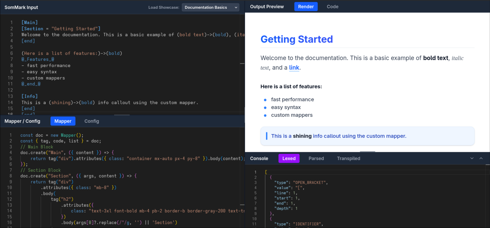
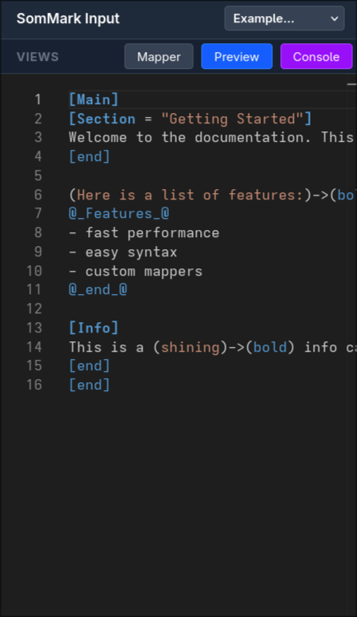
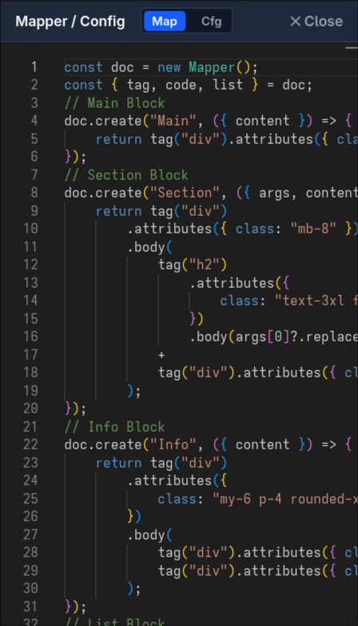
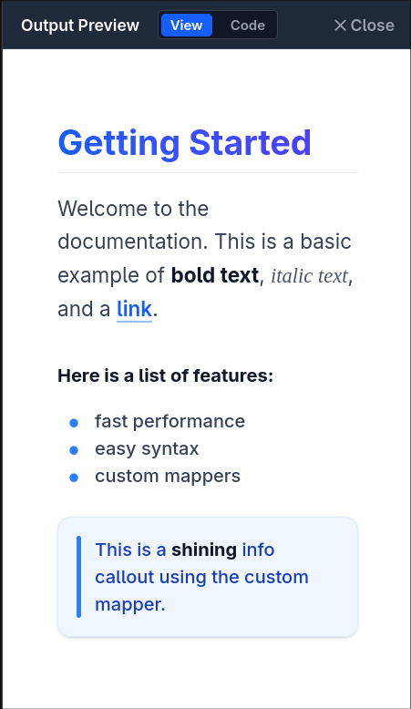

# SomMark Playground 

> The ultimate interactive environment for **SomMark** — a powerful, extensible markup language designed for modern documentation.



## Overview

**SomMark Playground** is a feature-rich, browser-based editor that allows you to write, compile, and preview SomMark code in real-time.

[**Live Demo**](https://adam-elmi.github.io/SomMark-Playground/)

## Key Features

- **Real-time Compilation**: See your SomMark code transform into HTML instantly.
- **Custom Syntax Highlighting**: Fully integrated Monaco Editor with custom SomMark tokenizer.
- **Configurable Mappers**: Define and test custom mappers directly in the browser to control how your content renders.
- **Fully Responsive**: A premium mobile experience with touch-optimized controls and dedicated preview modes.
- **Built-in Console & Debugging**: Built-in console to inspect the lexer tokens, parser output, and transpiler logs.

## Mobile Experience

The playground is designed to work seamlessly on any device.

<div style="display: flex; gap: 10px;">
  
  
  
</div>

## Getting Started

### Prerequisites

- Node.js (v18+)
- npm or yarn

### Installation

1. **Clone the repository**
   ```bash
   git clone https://github.com/Adam-Elmi/SomMark-Playground.git
   cd sommark-playground
   ```

2. **Install dependencies**
   ```bash
   npm install
   ```

3. **Start the development server**
   ```bash
   npm run dev
   ```

## Deployment

This project includes a fully automated deployment script for GitHub Pages.

```bash
# Deploys the current build to the gh-pages branch
npm run deploy
```

